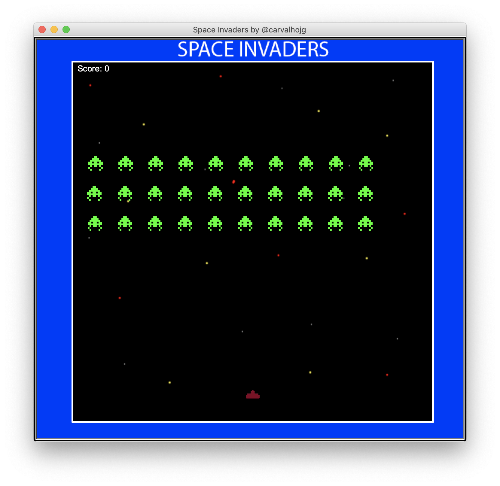

# Description
Arcade Space Invaders Game

# Libraries Used
1. Turtle
2. Random
3. Math
4. OS

# Personal learnings
1. Functions and objects
2. Implement math to figure collisions
3. Analyze multiple possibilities to result the end of the game

**Made by João Gabriel Carvalho Leite Santos**